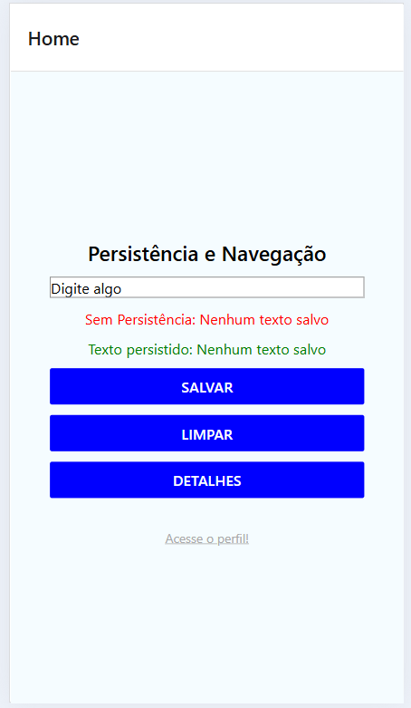
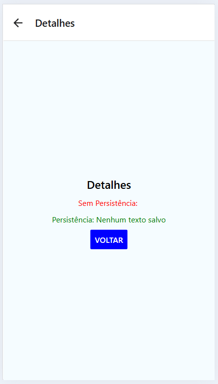
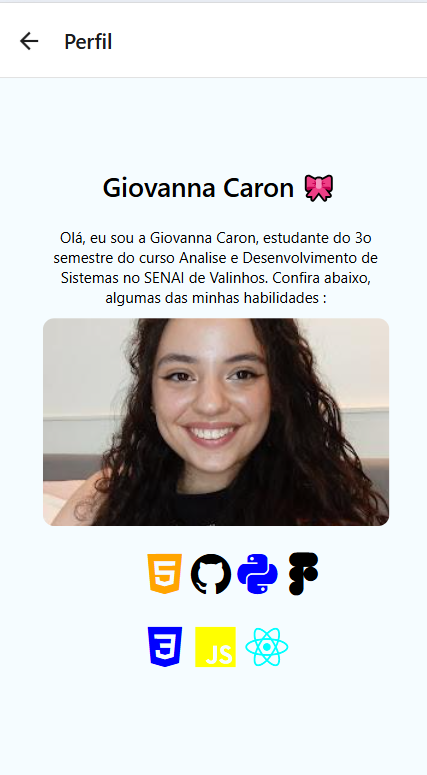

# ⚒️ Atividade 10 | Disciplina de Mobile 

## Criação de um App com a Página Home, Detalhes e Perfil 🤳🏻📲

Este projeto é um aplicativo simples em React Native com 3 páginas estilizadas com arquivos css separados, utilizando persistência de dados. 

Além de exibir um perfil de usuário com imagem, descrição e ícones de tecnologias usadas por desenvolvedores.

### Prints e Evidências

###### Home

###### Detalhes

###### Perfil

